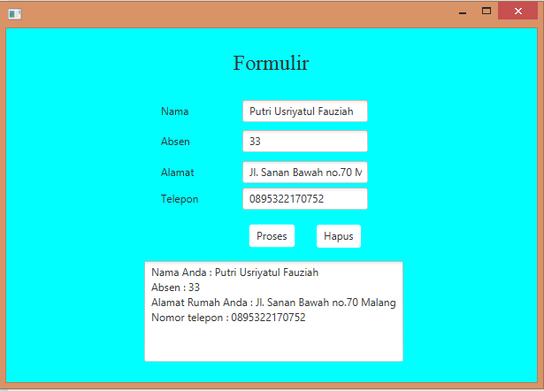

# Modul7JavaFX_BIODATA

Ketika program dijalankan maka output yang dikeluarkan adalah

Setelah itu, kita bisa menginputkan data kita yang nantinya akan kita proses dengan menekan button proses. Maka output yang ditampilkan adalah 

Apabila kita lupa untuk mengisi semua data maka output yang ditampilkan adalah 
![alt text](
dan langsung menekan button proses maka akan menampilkan output seperti gambar dibawah

Dan apabila kita akan menghapus data kita maka hanya cukup menekan button hapus saja maka semua data akan terhapus.

